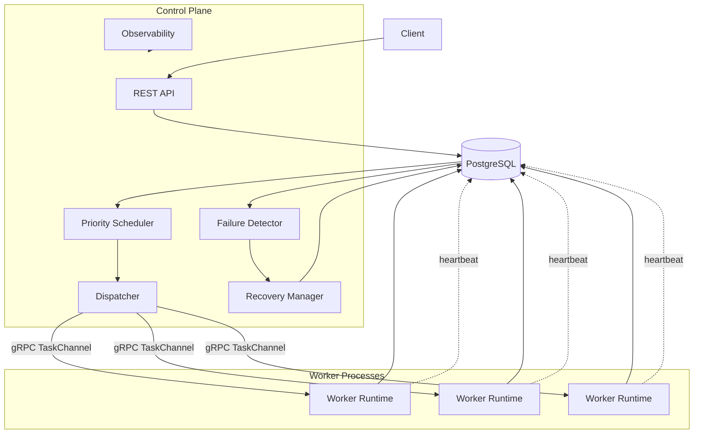
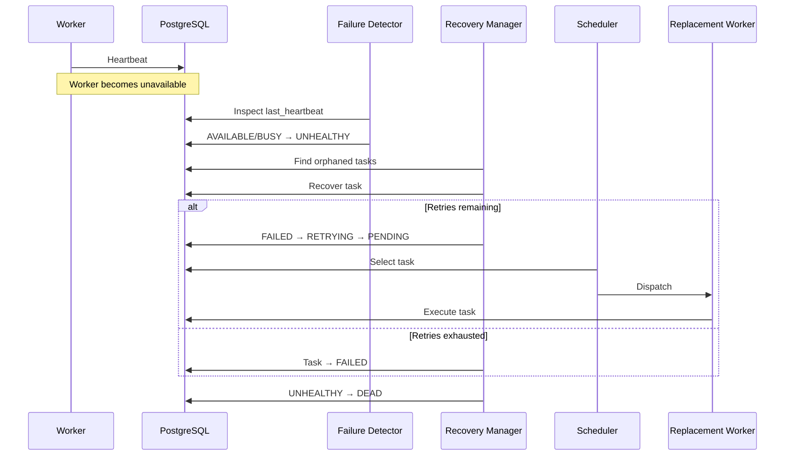

# ATLAS

### Fault-Tolerant Distributed Compute Platform

**ATLAS** is a Python-based distributed job execution platform built from scratch to explore the core engineering problems behind reliable distributed systems: scheduling, worker coordination, failure detection, recovery, retries, remote execution, persistence, observability, and concurrency.

The system uses **PostgreSQL as the durable source of truth**, **priority-based scheduling**, **worker heartbeats**, **failure detection**, **automatic recovery and retries**, and **gRPC-based task dispatch**.

> **Execution model:** At-least-once  
> **Source of truth:** PostgreSQL  
> **Architecture:** Centralized control plane + distributed workers  
> **Transport:** REST + gRPC  
> **Language:** Python

---

## Why ATLAS?

Distributed job execution looks simple until workers fail halfway through a task.

A production scheduler has to answer questions such as:

- What happens if a worker disappears while executing a task?
- How does the control plane know that a worker is dead?
- How are orphaned tasks recovered?
- How do retries avoid corrupting task state?
- What happens when an old worker sends a result after its task was reassigned?
- How do multiple components coordinate without introducing unnecessary infrastructure?
- What guarantees can the system actually make about execution?

ATLAS is designed around these problems.

Its core lifecycle is:

```text
SCHEDULE → EXECUTE → DETECT → RECOVER
```

---

## Architecture

The control plane runs as **one process** (`atlas.control_plane.main`):
the gRPC server's `GrpcWorkerRegistry` is in-process state, so it and
everything that dispatches through it (Scheduler, Dispatcher,
FailureDetector, RecoveryManager) must share that one instance — see
ADR-001. It also serves the REST API.



### Component responsibilities

| Component | Responsibility |
|---|---|
| **Job API** | Accept and manage jobs |
| **Job Service** | Job lifecycle operations |
| **Scheduler** | Select runnable tasks and available workers |
| **Dispatcher** | Deliver scheduled tasks to workers |
| **Worker Runtime** | Execute tasks and persist execution attempts |
| **Heartbeat** | Publish worker liveness |
| **Failure Detector** | Detect stale workers |
| **Recovery Manager** | Recover orphaned tasks and manage retries |
| **gRPC Server** | Remote worker communication |
| **PostgreSQL** | Durable system state |
| **Observability** | Structured events, metrics and health information |

---

# Core Execution Flow

A job moves through the system as follows:

```text
1. Submit
   │
   ▼
2. Persist in PostgreSQL
   │
   ▼
3. Queue
   │
   ▼
4. Schedule
   │
   ▼
5. Dispatch
   │
   ▼
6. Execute
   │
   ▼
7. Persist TaskAttempt
   │
   ▼
8. Complete
```

The scheduler prioritizes jobs and selects available workers without directly executing or assigning tasks.

The dispatcher is responsible for transport.

The worker runtime owns execution.

This separation keeps scheduling, transport, execution, and recovery independently testable.

---

# Failure Handling

Worker failures are first detected through heartbeat timeouts.



### Worker lifecycle

```text
REGISTERING
     │
     ▼
 AVAILABLE
     │
     ├───────────────┐
     │               │
     ▼               ▼
   BUSY          DRAINING
     │               │
     │               ▼
     │              DEAD
     │
     ▼
 UNHEALTHY
     │
     ▼
   DEAD
```

ATLAS deliberately does **not** automatically transition:

```text
UNHEALTHY → AVAILABLE
```

A worker declared unhealthy is retired from the current lifecycle rather than being silently reintroduced into scheduling.

---

# At-Least-Once Execution

ATLAS intentionally provides **at-least-once execution semantics**.

It does **not** claim exactly-once execution.

A worker can successfully execute a task immediately before becoming unreachable. If the control plane cannot observe that success, the task may be recovered and executed again.

Therefore:

```text
Task execution may happen more than once.
```

Applications running on ATLAS should therefore prefer **idempotent task operations** where possible.

This is a deliberate distributed-systems tradeoff rather than an accidental limitation.

---

# Preventing Stale Result Corruption

One subtle distributed race appears when a task is recovered and dispatched again while an old execution can still produce a late result.

Correlating results only by:

```text
task_id
```

is unsafe.

ATLAS therefore correlates remote execution results using:

```text
(task_id, attempt)
```

For example:

```text
Execution #1
Task A + Attempt 1
        │
        │ worker failure
        ▼
Recovery
        │
        ▼
Execution #2
Task A + Attempt 2
```

A late result for:

```text
(Task A, Attempt 1)
```

cannot satisfy the waiter for:

```text
(Task A, Attempt 2)
```

This race was reproduced against the original implementation and covered by a dedicated regression test.

---

# Technology Stack

### Core

- **Python**
- **PostgreSQL**
- **SQLAlchemy 2.x**
- **Alembic**
- **FastAPI**
- **Pydantic**
- **gRPC / Protocol Buffers**
- **pytest**
- **Docker / Docker Compose**

### Design philosophy

ATLAS intentionally avoids introducing infrastructure such as:

- Redis
- Kafka
- RabbitMQ
- Celery
- Kubernetes

unless a future architectural requirement genuinely justifies them.

The goal is to understand and implement the distributed-system primitives directly rather than hiding them behind a framework.

---

# Project Structure

```text
atlas/
├── alembic/
├── docker/
│   ├── postgres-init/
│   └── grant-worker-privileges.sql
│
├── docs/
│   ├── architecture/
│   ├── design/
│   ├── api/
│   ├── database/
│   └── operations/
│
├── plans/
│   ├── phase-00-foundation.md
│   ├── phase-01-domain-model.md
│   ├── phase-02-persistence.md
│   ├── phase-03-job-api.md
│   ├── phase-04-worker-runtime.md
│   ├── phase-05-scheduler.md
│   ├── phase-06-dispatch.md
│   ├── phase-07-heartbeats.md
│   ├── phase-08-failure-detection.md
│   ├── phase-09-recovery-retries.md
│   ├── phase-10-grpc.md
│   ├── phase-11-observability.md
│   ├── phase-12-integration-e2e.md
│   └── phase-13-hardening.md
│
├── proto/
│   └── atlas.proto
│
├── src/
│   └── atlas/
│       ├── api/
│       ├── domain/
│       ├── dispatch/
│       ├── failure_detection/
│       ├── grpc_server/
│       ├── observability/
│       ├── persistence/
│       ├── recovery/
│       ├── scheduler/
│       ├── services/
│       └── worker/
│
├── tests/
│   ├── api/
│   ├── dispatch/
│   ├── domain/
│   ├── e2e/
│   ├── failure_detection/
│   ├── grpc/
│   ├── observability/
│   ├── persistence/
│   ├── recovery/
│   ├── scheduler/
│   └── worker/
│
├── docker-compose.yml
├── Makefile
├── pyproject.toml
└── README.md
```

---

# Quick Start

## Prerequisites

- Python 3.11+
- Docker
- Docker Compose
- PostgreSQL 15+ if running PostgreSQL outside Docker

---

## 1. Clone

```bash
git clone https://github.com/PulkitTiwari87/ATLAS.git
cd ATLAS
```

---

## 2. Run the full stack with Docker Compose

```bash
docker compose up --build
```

This starts three services:

- **postgres** — PostgreSQL 15, the durable source of truth.
- **control-plane** — the one process that owns the shared
  `GrpcWorkerRegistry` and runs the REST API (`:8000`), the gRPC server
  (`:50051`), `DispatchLoop` (Scheduler + Dispatcher), `FailureDetector`,
  and `RecoveryManager`. On startup it runs `alembic upgrade head` and
  grants the least-privilege `atlas_worker` role its table privileges —
  no manual migration step needed for a fresh deployment.
- **worker-1** — a gRPC worker process that registers with the control
  plane and executes dispatched tasks, connecting to PostgreSQL as the
  restricted `atlas_worker` role.

Verify:

```bash
docker compose ps
curl http://localhost:8000/health
```

`GrpcWorkerRegistry` is in-process state, so the gRPC server and everything
that dispatches through it (Scheduler, Dispatcher, FailureDetector,
RecoveryManager) must run in that same process — see `atlas.control_plane.main`
and ADR-001. Running only PostgreSQL this way (`docker compose up -d postgres`)
is still useful for local, non-Docker development against the steps below.

---

## 3. Create the Python environment

```bash
python -m venv .venv
```

### Linux/macOS

```bash
source .venv/bin/activate
```

### Windows

```powershell
.venv\Scripts\activate
```

Install ATLAS:

```bash
pip install -e .
```

---

## 4. Configure the environment

```bash
cp .env.example .env
```

Review the configuration before starting the application.

Important defaults include:

```text
ATLAS_PORT=8000
GRPC_PORT=50051
HEARTBEAT_INTERVAL=5
WORKER_TIMEOUT=30
MAX_RETRIES=3
```

ATLAS validates configuration at startup and rejects invalid combinations such as a heartbeat interval greater than or equal to the worker timeout.

---

## 5. Run database migrations (non-Docker only)

```bash
alembic upgrade head
```

Only needed when running the control plane directly with `python -m
atlas.control_plane.main` outside Docker — it also runs this
automatically on startup, same as the Docker image does.

---

## 6. Run the test suite

```bash
pytest -q
```

Current verification (requires a reachable PostgreSQL; otherwise the
DB-backed tests skip):

```text
203 passed
```

The full suite has been repeatedly executed with zero failures.

---

# Running ATLAS

## Production composition: the control plane

```bash
python -m atlas.control_plane.main
```

This is the one process a real deployment runs. It owns the single shared
`GrpcWorkerRegistry` and starts, in order: a database-migration check
(`alembic upgrade head`), the `atlas_worker` privilege grant, the gRPC
server, `DispatchLoop` (Scheduler + Dispatcher), `FailureDetector`, and
`RecoveryManager` — then serves the REST API. This is exactly what
`docker compose up` runs as the `control-plane` service.

Health check: `GET /health`. Metrics: `GET /metrics`.

`python -m atlas.main` (`uvicorn atlas.main:app`) still works for
REST-only local development (e.g. exercising the Job API without a
worker), but it does not start the gRPC server or any of the background
loops — nothing will get dispatched.

---

## gRPC Server

The gRPC server listens on the configured `GRPC_PORT` (default `50051`),
started by the control plane above. Workers connect through the
bidirectional `TaskChannel` stream.

---

## Worker

A worker runs as its own process, talking to the control plane over gRPC:

```bash
python -m atlas.worker.grpc_main
```

Workers:

1. register with the control plane;
2. establish the task channel;
3. send heartbeats;
4. receive tasks;
5. execute tasks locally;
6. persist execution attempts;
7. report task completion.

---

# Example Job

A task can use the built-in shell executor.

Conceptually:

```json
{
  "name": "example-job",
  "priority": 10,
  "tasks": [
    {
      "type": "shell",
      "payload": {
        "command": "echo 'Hello from ATLAS'"
      }
    }
  ]
}
```

The task then flows through:

```text
Job API
   ↓
PostgreSQL
   ↓
Scheduler
   ↓
Dispatcher
   ↓
Worker
   ↓
WorkerRuntime
   ↓
TaskAttempt
```

---

# Testing Strategy

ATLAS uses multiple testing layers.

### Unit Tests

Validate:

- domain state transitions;
- scheduling decisions;
- retry decisions;
- configuration validation;
- structured logging;
- execution behavior;
- gRPC handler behavior.

### Integration Tests

Use a real PostgreSQL instance to validate:

- repositories;
- persistence;
- worker heartbeats;
- failure detection;
- recovery;
- gRPC communication;
- task execution.

### End-to-End Tests

The E2E harness runs real components together:

```text
JobService
   ↓
Scheduler
   ↓
Dispatcher
   ↓
WorkerRuntime
   ↓
PostgreSQL

FailureDetector
   ↓
RecoveryManager
   ↓
Scheduler
```

E2E scenarios cover:

- normal execution;
- multiple workers;
- worker failure;
- heartbeat loss;
- orphaned task recovery;
- retries;
- retry exhaustion;
- duplicate execution;
- shutdown;
- stale worker detection.

---

# Reliability Properties

| Property | ATLAS |
|---|---|
| Durable job/task state | PostgreSQL |
| Worker heartbeats | Yes |
| Failure detection | Yes |
| Automatic task recovery | Yes |
| Bounded retries | Yes |
| Priority scheduling | Yes |
| Job status aggregated from tasks | Yes (`QUEUED`→`RUNNING`→`COMPLETED`/`FAILED`) |
| Remote worker execution | gRPC |
| Stale-result protection | `(task_id, attempt)` |
| Observability | Structured logs + metrics |
| At-least-once execution | Yes |
| Exactly-once execution | **No** |
| Automatic unhealthy-worker resurrection | **No** |
| Full process sandboxing | **No** |

---

# Hardening

The final hardening phase includes:

### Configuration validation

Invalid values are rejected before the application starts.

### Shell task validation

Malformed shell payloads fail cleanly instead of producing an uncaught `KeyError`.

### Resource limits

On POSIX systems, shell tasks receive:

- CPU limits
- address-space limits
- existing wall-clock timeout

ATLAS does **not** claim to be a full security sandbox.

### gRPC validation

Malformed worker identifiers and invalid RPC inputs return appropriate gRPC errors such as:

```text
INVALID_ARGUMENT
```

instead of leaking unhandled application exceptions.

### Database privileges

Worker processes can use a dedicated PostgreSQL role with restricted privileges rather than sharing the control-plane database role.

---

# Observability

ATLAS emits structured lifecycle events such as:

```text
job.created
job.queued

task.claimed
task.started
task.succeeded
task.failed
task.recovered

worker.heartbeat_started
worker.heartbeat_stopped
worker.unhealthy
worker.dead

dispatch.dispatched
dispatch.skipped
```

The `/metrics` endpoint derives current job, task, and worker counts directly from PostgreSQL rather than maintaining separate in-memory counters.

---

# Design Principles

ATLAS was intentionally developed around a few principles.

### 1. PostgreSQL is the source of truth

Durable distributed state should not depend on an in-memory coordinator surviving.

### 2. Components own specific responsibilities

```text
Scheduler       → scheduling
Dispatcher      → transport
WorkerRuntime   → execution
FailureDetector → failure detection
RecoveryManager → recovery
PostgreSQL      → durable state
```

### 3. Short transactions

The system avoids holding database transactions across long-running task execution.

### 4. Fresh state before critical transitions

Components re-fetch state before committing important distributed-state transitions to reduce stale-observation races.

### 5. At-least-once over false guarantees

The system explicitly accepts duplicate execution rather than pretending distributed execution can be exactly-once without the necessary coordination and idempotency mechanisms.

### 6. Minimal infrastructure

The system implements its core coordination mechanisms directly rather than hiding them behind a large distributed framework.

---

# Development Roadmap

ATLAS was implemented incrementally across 14 phases:

```text
00  Foundation
01  Domain Model
02  Persistence
03  Job API
04  Worker Runtime
05  Scheduler
06  Dispatch
07  Heartbeats
08  Failure Detection
09  Recovery + Retries
10  gRPC
11  Observability
12  Integration + E2E Testing
13  Hardening
```

Each phase was implemented and validated independently before moving to the next.

The final system has:

```text
198 tests passing
1 platform-specific test skipped
0 test failures
```

---

# Known Limitations

ATLAS intentionally does not attempt to solve every distributed-systems problem.

Current limitations include:

- No exactly-once execution guarantee.
- Duplicate task execution remains possible after worker failure.
- An unhealthy worker is not automatically returned to `AVAILABLE`.
- Shell execution is not a full security sandbox.
- gRPC authentication/mTLS is not implemented.
- No distributed rate limiting.
- No application-level idempotency-key system.
- Metrics are intentionally lightweight rather than a complete Prometheus/OpenTelemetry stack.
- Worker database credential isolation is deployment-level hardening rather than a complete secrets-management solution.
- `Dispatcher.dispatch_all()` delivers proposals from one scheduler cycle
  sequentially, and each dispatch blocks the shared `DispatchLoop` thread
  until that task's execution finishes (or, over gRPC, until the
  310-second result wait times out). A single unresponsive worker
  therefore delays scheduling for *other* proposals until that call
  resolves. `FailureDetector`/`RecoveryManager` run as independent
  threads and are unaffected — failure detection and retry-requeueing
  still happen on their own ~`WORKER_TIMEOUT`-second schedule regardless.
  This is invisible in the default single-worker topology and a real
  constraint on multi-worker deployments; making dispatch concurrent
  would be a genuine architecture change, not a wiring fix.

These are explicit architectural boundaries, not hidden guarantees.

---

# What This Project Demonstrates

ATLAS is primarily a systems-engineering project.

It demonstrates practical work with:

- Distributed systems
- Fault tolerance
- Scheduling
- Concurrency
- State machines
- PostgreSQL transactions
- Worker coordination
- Failure detection
- Retry semantics
- gRPC
- REST APIs
- Docker
- Resource limits
- Structured observability
- Integration testing
- End-to-end testing
- Race-condition debugging
- At-least-once execution semantics

The project also deliberately documents **why** certain guarantees are not provided rather than hiding distributed-systems tradeoffs behind simplified terminology.

---

# License

MIT License.

---

## Author

**Pulkit Tiwari**

GitHub: [@PulkitTiwari87](https://github.com/PulkitTiwari87)

---

<p align="center">
  <b>ATLAS — SCHEDULE → EXECUTE → DETECT → RECOVER</b>
</p>
