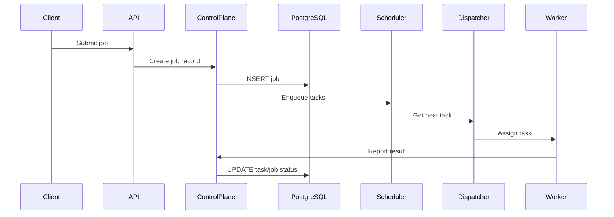

# Data Flow

Document the end‑to‑end data movement in Atlas.

## Flow Steps
1. **Job Submission** – Client POSTs a job to the REST/gRPC API.
2. **Persistence** – Control plane writes job and initial task records to PostgreSQL.
3. **Scheduling** – Scheduler places tasks on the priority queue.
4. **Dispatch** – Dispatcher selects a healthy worker and assigns the task.
5. **Execution** – Worker executes the task, streams logs, and reports the result.
6. **Completion** – Control plane updates task and job status, stores output metadata.

## Sequence Diagram

