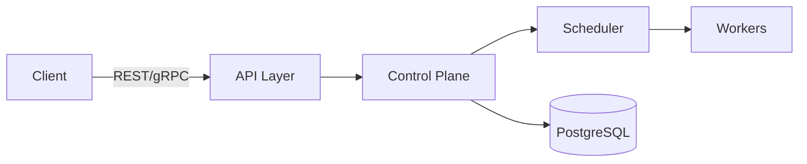

# System Overview

Atlas consists of a **control plane** and a set of **worker nodes**.

- **Control Plane** – Provides REST/gRPC APIs, coordinates scheduling, maintains persistent state in PostgreSQL, monitors worker health, and handles failure recovery.
- **Workers** – Register with the control plane, receive task assignments, execute user code, and report results.
- **PostgreSQL** – Single source of truth for jobs, tasks, workers, and heartbeats.
- **Clients** – Submit jobs via the public API.

## High‑Level Diagram

The diagram shows the flow of a job from submission to execution and completion, as well as the persistent storage relationship.
