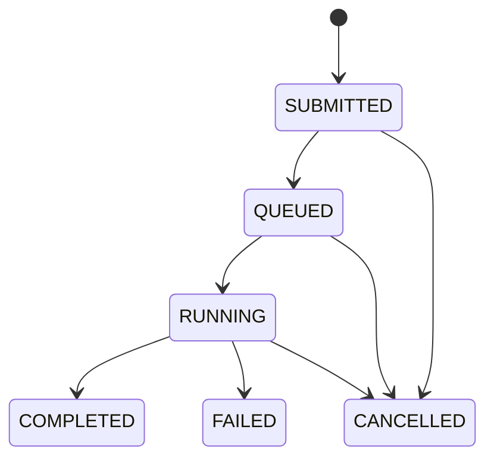

# Job Lifecycle

Define the primary states for a job:

- **SUBMITTED** – Job received via API, persisted.
- **QUEUED** – All tasks are pending scheduling.
- **RUNNING** – At least one task is in RUNNING state.
- **COMPLETED** – All tasks have succeeded.
- **FAILED** – One or more tasks have permanently failed.
- **CANCELLED** – Client requested cancellation.

### State Transitions

Transitions are driven by task state changes recorded in PostgreSQL.
