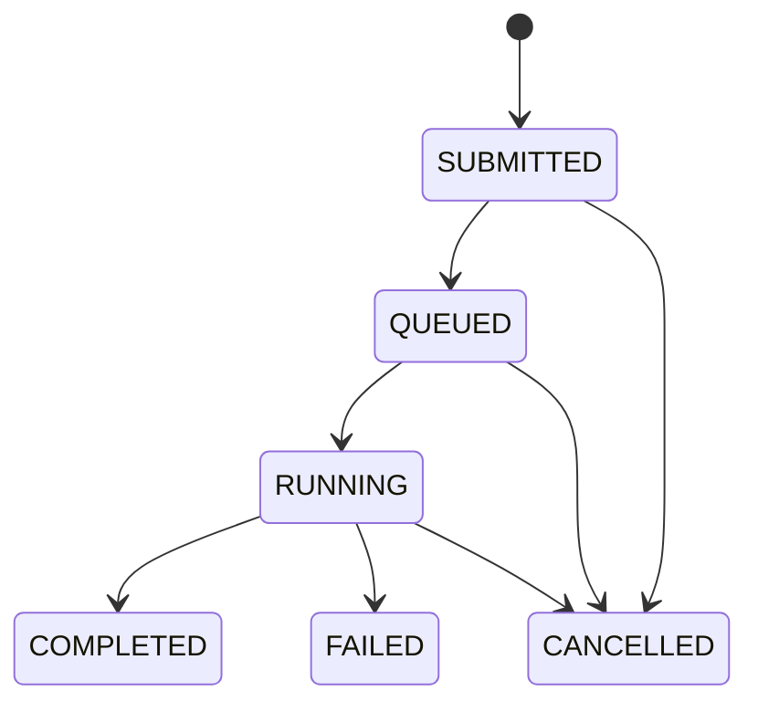
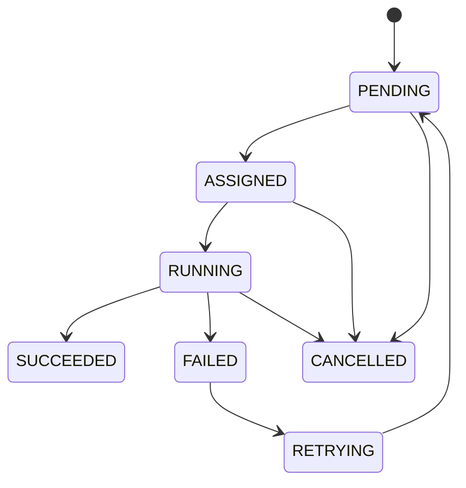
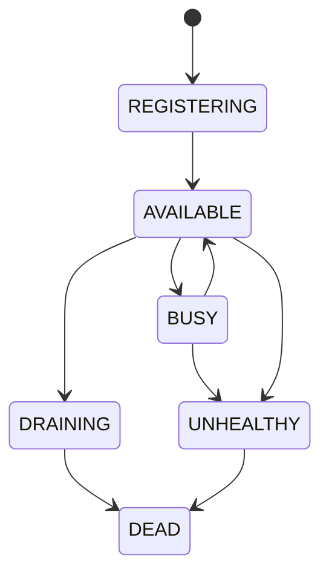

# State Machines

## Job State Machine

```mermaid
stateDiagram-v2
    [*] --> SUBMITTED
    SUBMITTED --> QUEUED
    QUEUED --> RUNNING
    RUNNING --> COMPLETED
    RUNNING --> FAILED
    RUNNING --> CANCELLED
    QUEUED --> CANCELLED
    SUBMITTED --> CANCELLED
```

## Task State Machine

```mermaid
stateDiagram-v2
    [*] --> PENDING
    PENDING --> ASSIGNED
    ASSIGNED --> RUNNING
    RUNNING --> SUCCEEDED
    RUNNING --> FAILED
    FAILED --> RETRYING
    RETRYING --> PENDING
    RUNNING --> CANCELLED
    ASSIGNED --> CANCELLED
    PENDING --> CANCELLED
```

## Worker State Machine

```mermaid
stateDiagram-v2
    [*] --> REGISTERING
    REGISTERING --> AVAILABLE
    AVAILABLE --> BUSY
    BUSY --> AVAILABLE
    AVAILABLE --> DRAINING
    DRAINING --> DEAD
    BUSY --> UNHEALTHY
    AVAILABLE --> UNHEALTHY
    UNHEALTHY --> DEAD
```

These state diagrams define the valid transitions that will be enforced by the control plane.
