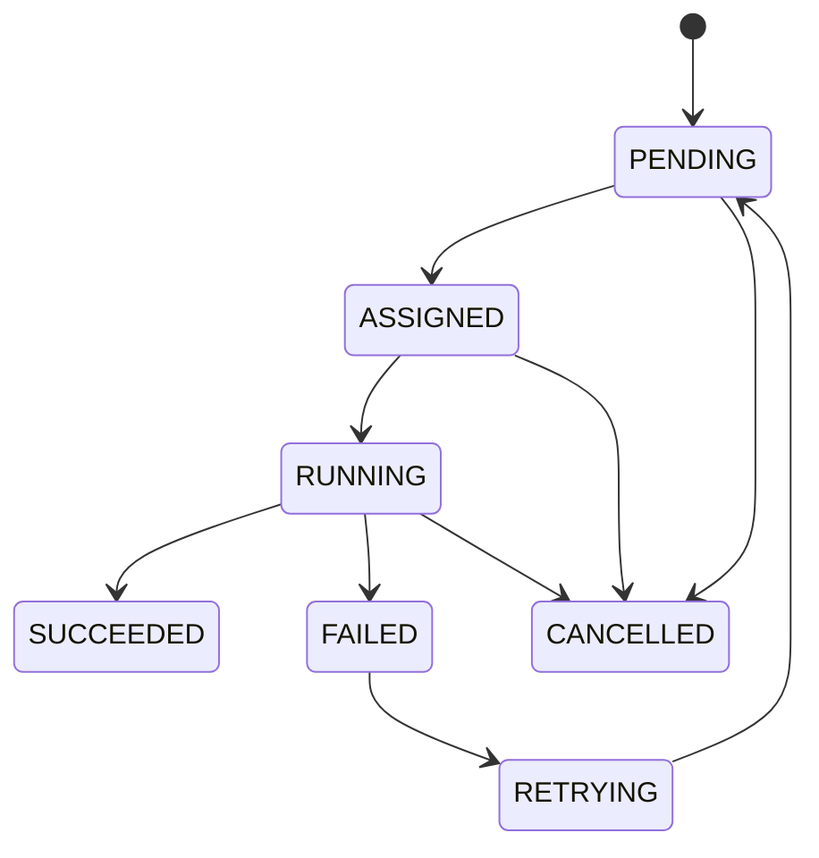

# Task Lifecycle

Define the primary states for a task:

- **PENDING** – Task is created but not yet assigned.
- **ASSIGNED** – Task has been allocated to a worker but not started.
- **RUNNING** – Worker is executing the task.
- **SUCCEEDED** – Task completed successfully.
- **FAILED** – Task execution failed (error or crash).
- **RETRYING** – Task will be retried after a failure.
- **CANCELLED** – Task was cancelled before completion.

### State Transitions

Transitions are persisted in PostgreSQL and driven by the scheduler, dispatcher, and worker runtime.
