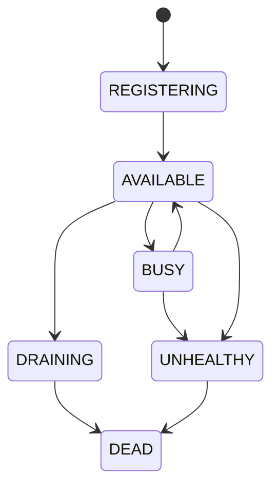

# Worker Lifecycle

Define the primary states for a worker node:

- **REGISTERING** – Worker instance is starting up and registering with the control plane.
- **AVAILABLE** – Worker is idle and ready to accept tasks.
- **BUSY** – Worker is currently executing a task.
- **UNHEALTHY** – Worker missed heartbeats and is considered unhealthy.
- **DEAD** – Worker is considered permanently offline.
- **DRAINING** – Worker is shutting down gracefully, finishing in‑flight tasks before exiting.

### State Transitions

Transitions are driven by heartbeat monitoring and explicit shutdown commands.
